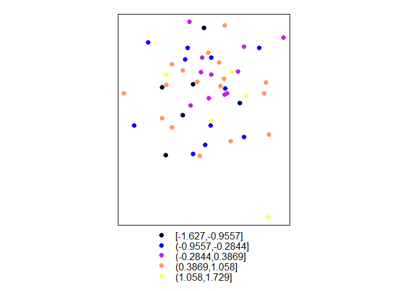

# This example demonstrates creation of some sp objects.

You can find a more complete demonstration of working with spatial
object in R here:
<https://mgimond.github.io/Spatial/reading-and-writing-spatial-data-in-r.html>

Dealing with points is relatively easy compared to polygons

``` r
library(raster)
library(sp)
library(rgdal)
library(sf)

# Approach 1
npts = 50
pts_df = data.frame(id=1:npts,x=rnorm(npts)*1000+10e6, y=rnorm(npts)*1000+10e6 , z=rnorm(npts))
coordinates(pts_df) = ~x+y
# Approach 2
npts = 50
pts_df = data.frame(id=1:npts,x=rnorm(npts)*1000+10e6, y=rnorm(npts)*1000+10e6 , z=rnorm(npts))
coordinates(pts_df) = pts_df[,c("x","y")]

pts_df
```

    ## class       : SpatialPointsDataFrame 
    ## features    : 50 
    ## extent      : 9997393, 10001977, 9997573, 10002230  (xmin, xmax, ymin, ymax)
    ## crs         : NA 
    ## variables   : 4
    ## names       : id,                x,                y,                 z 
    ## min values  :  1, 9997393.36261684, 9997572.90556751, -2.54060394082687 
    ## max values  : 50,   10001976.86335, 10002230.4381371,  2.78352640377107

``` r
plot(pts_df)
```

<!-- -->

``` r
spplot(pts_df,zcol="z")
```

<!-- -->

Add projection to pts\_df and write to a shapefile. You will need to
figure out your projection string if you don’t already have it e.g. you
can search here <https://www.spatialreference.org/> I have selected this
projection for this toy example
<https://www.spatialreference.org/ref/epsg/3692/proj4/> See here for
more details on projections in R:
<https://www.nceas.ucsb.edu/sites/default/files/2020-04/OverviewCoordinateReferenceSystems.pdf>

``` r
some_proj4 = "+proj=lcc +lat_1=47.33333333333334 +lat_2=45.83333333333334 +lat_0=45.33333333333334 +lon_0=-120.5 +x_0=500000.0001016001 +y_0=0 +ellps=GRS80 +towgs84=0,0,0,0,0,0,0 +to_meter=0.3048006096012192 +no_defs"

proj4string(pts_df) = some_proj4

#shapefiles are not great, but they are the most common spatial objects (field name restrictions, file size limitations, proprietary, etc.)
unlink("c:/temp/example_pts.shp",force=T)
rgdal::writeOGR(pts_df,dsn="c:/temp","example_pts1", driver = "ESRI Shapefile", overwrite_layer = T)

#A better option is the open source geopackage (it's like an ESRI file geodatabase). Unfortunately rgdal has pretty lousy support for geopackages as far as I can tell, e.g it cannot append. 
if(file.exists("c:/temp/demo_geopackage.gpkg")) try(unlink("c:/temp/demo_geopackage.gpkg",force=T))
rgdal::writeOGR(pts_df,dsn="c:/temp/demo_geopackage.gpkg","example_pts1", driver = "GPKG")

#the sf package does a better job, but you have to convert from sp to sf first... It seems like sf objects are a better data model (basically an R data frame), but most spatial packages in R still use sp objects.
pts_df_sf = sf::st_as_sf(pts_df)

#this add a new layer to the geopackage - not possible with rgdal (for geopackages)
sf::st_write(pts_df_sf,dsn="c:/temp/demo_geopackage.gpkg", "example_pts2", driver="GPKG") 
```

    ## Writing layer `example_pts2' to data source `c:/temp/demo_geopackage.gpkg' using driver `GPKG'
    ## Writing 50 features with 4 fields and geometry type Point.

``` r
#we can even append new rows to an existing object using sf - definitely not possible with rgdal (for geopackages)
pts_df_sf2 = pts_df_sf  
row.names(pts_df_sf2 ) = as.numeric(row.names(pts_df_sf )) + max(as.numeric(row.names(pts_df_sf ))) 
pts_df_sf2$id = pts_df_sf$id + max(pts_df_sf$id)
sf::st_write(pts_df_sf,dsn="c:/temp/demo_geopackage.gpkg", "example_pts2", driver="GPKG",append=T) 
```

    ## Updating layer `example_pts2' to data source `c:/temp/demo_geopackage.gpkg' using driver `GPKG'
    ## Updating existing layer example_pts2
    ## Writing 50 features with 4 fields and geometry type Point.

``` r
#verify that append works
pts_df_sf3 = sf::read_sf(dsn="c:/temp/demo_geopackage.gpkg", "example_pts2")

#notice that pts_df_sf3 has npts*2 records ...
nrow(pts_df_sf)
```

    ## [1] 50

``` r
nrow(pts_df_sf2)
```

    ## [1] 50

``` r
nrow(pts_df_sf3)
```

    ## [1] 100

``` r
knitr::kable(pts_df_sf3)
```

| id |        x |        y |           z | geom                                  |
| -: | -------: | -------: | ----------: | :------------------------------------ |
|  1 |  9998605 | 10000666 | \-0.3979345 | c(9998604.57503564, 10000665.6805516) |
|  2 | 10000205 | 10000366 | \-0.3372885 | c(10000204.7048285, 10000365.6382862) |
|  3 |  9999709 | 10000176 |   1.1534423 | c(9999709.05789937, 10000176.4273152) |
|  4 |  9997393 |  9999478 | \-2.5406039 | c(9997393.36261684, 9999478.06364238) |
|  5 | 10000640 | 10000022 | \-0.1561983 | c(10000639.934128, 10000022.0754889)  |
|  6 |  9999089 | 10000227 |   1.3060210 | c(9999089.49071879, 10000227.2963287) |
|  7 |  9999910 |  9999230 |   0.0886368 | c(9999909.85446513, 9999229.53811584) |
|  8 | 10000549 | 10001177 | \-0.3632220 | c(10000548.519717, 10001176.9045224)  |
|  9 | 10000340 | 10000713 | \-1.3167291 | c(10000340.0430948, 10000712.6885824) |
| 10 |  9999024 | 10002230 | \-0.4066539 | c(9999023.85625262, 10002230.4381371) |
| 11 | 10000021 |  9999049 | \-0.0303919 | c(10000020.7219632, 9999049.00050202) |
| 12 |  9998736 | 10000972 | \-0.3242257 | c(9998735.52127763, 10000971.5107734) |
| 13 | 10000393 |  9999184 |   0.2557322 | c(10000392.8867346, 9999184.34886472) |
| 14 |  9999659 |  9999263 |   0.2910636 | c(9999658.6620167, 9999263.25122299)  |
| 15 |  9999997 | 10000887 |   2.3560020 | c(9999997.4164563, 10000886.5265664)  |
| 16 |  9999424 | 10000715 | \-1.1667303 | c(9999423.8605223, 10000714.6682061)  |
| 17 | 10001421 | 10000163 |   0.2193435 | c(10001420.6105881, 10000162.6590104) |
| 18 | 10000487 |  9999558 | \-0.0167706 | c(10000487.1746118, 9999557.5316124)  |
| 19 | 10001331 |  9999370 |   0.1436824 | c(10001330.8376507, 9999369.94752377) |
| 20 | 10000262 | 10000119 |   0.6517898 | c(10000261.8004029, 10000119.1996214) |
| 21 | 10000017 |  9998785 | \-1.5074244 | c(10000017.0384153, 9998785.15045303) |
| 22 | 10001024 |  9999869 |   0.0225290 | c(10001023.67097, 9999868.56119802)   |
| 23 |  9999285 |  9999538 | \-0.0825771 | c(9999284.81383589, 9999538.19109866) |
| 24 |  9999553 |  9998735 | \-0.7304137 | c(9999552.75144005, 9998735.1739128)  |
| 25 |  9999303 |  9999080 |   0.6893945 | c(9999302.68652241, 9999079.5301788)  |
| 26 |  9999575 |  9997573 |   0.5415895 | c(9999574.66041795, 9997572.90556751) |
| 27 | 10001097 | 10000006 |   0.2787269 | c(10001097.378102, 10000006.1004386)  |
| 28 | 10000142 | 10000884 |   2.7835264 | c(10000141.919697, 10000884.023271)   |
| 29 | 10001156 | 10001776 |   0.7616582 | c(10001155.7893427, 10001775.9228689) |
| 30 |  9999315 | 10000843 |   1.1456410 | c(9999315.23097434, 10000843.4755474) |
| 31 | 10000274 | 10001650 |   0.1691039 | c(10000274.3977138, 10001650.1274152) |
| 32 |  9999427 | 10000354 |   1.1723768 | c(9999426.82839834, 10000353.9714859) |
| 33 | 10001197 | 10000694 | \-0.6869396 | c(10001197.471562, 10000693.9132781)  |
| 34 | 10000283 |  9999584 | \-0.5231430 | c(10000283.4766825, 9999584.4763131)  |
| 35 | 10001491 | 10001117 | \-0.4696889 | c(10001491.0256297, 10001116.9278298) |
| 36 | 10001977 |  9998294 | \-0.7737433 | c(10001976.86335, 9998293.9920419)    |
| 37 |  9999397 | 10001152 | \-0.9013275 | c(9999396.83674204, 10001152.1774615) |
| 38 | 10001923 |  9999752 |   1.3172671 | c(10001922.6396027, 9999751.89337059) |
| 39 |  9999823 |  9999802 | \-0.4091118 | c(9999823.1804121, 9999801.52857923)  |
| 40 |  9998512 |  9999332 |   1.4521647 | c(9998512.48548828, 9999331.74223671) |
| 41 | 10000805 |  9999940 | \-1.0741653 | c(10000804.8323613, 9999939.90622172) |
| 42 | 10000500 | 10000335 |   0.2917528 | c(10000499.5841219, 10000334.9976451) |
| 43 |  9999767 |  9999931 |   1.5457123 | c(9999766.92818211, 9999930.52137325) |
| 44 |  9999844 | 10001647 | \-0.4190852 | c(9999843.76126021, 10001646.5109742) |
| 45 | 10001131 | 10000762 | \-1.1978423 | c(10001130.5449464, 10000761.9825137) |
| 46 | 10000112 |  9999869 |   0.7993778 | c(10000111.7126639, 9999869.27557022) |
| 47 |  9999879 |  9999084 |   0.2938154 | c(9999878.80041325, 9999083.74752587) |
| 48 |  9999748 |  9999053 |   1.6479113 | c(9999748.13813222, 9999053.05384505) |
| 49 |  9999310 |  9999494 | \-0.2464682 | c(9999309.91968829, 9999494.4299643)  |
| 50 |  9997923 | 10000369 | \-1.6104559 | c(9997922.62779647, 10000369.2304758) |
|  1 |  9998605 | 10000666 | \-0.3979345 | c(9998604.57503564, 10000665.6805516) |
|  2 | 10000205 | 10000366 | \-0.3372885 | c(10000204.7048285, 10000365.6382862) |
|  3 |  9999709 | 10000176 |   1.1534423 | c(9999709.05789937, 10000176.4273152) |
|  4 |  9997393 |  9999478 | \-2.5406039 | c(9997393.36261684, 9999478.06364238) |
|  5 | 10000640 | 10000022 | \-0.1561983 | c(10000639.934128, 10000022.0754889)  |
|  6 |  9999089 | 10000227 |   1.3060210 | c(9999089.49071879, 10000227.2963287) |
|  7 |  9999910 |  9999230 |   0.0886368 | c(9999909.85446513, 9999229.53811584) |
|  8 | 10000549 | 10001177 | \-0.3632220 | c(10000548.519717, 10001176.9045224)  |
|  9 | 10000340 | 10000713 | \-1.3167291 | c(10000340.0430948, 10000712.6885824) |
| 10 |  9999024 | 10002230 | \-0.4066539 | c(9999023.85625262, 10002230.4381371) |
| 11 | 10000021 |  9999049 | \-0.0303919 | c(10000020.7219632, 9999049.00050202) |
| 12 |  9998736 | 10000972 | \-0.3242257 | c(9998735.52127763, 10000971.5107734) |
| 13 | 10000393 |  9999184 |   0.2557322 | c(10000392.8867346, 9999184.34886472) |
| 14 |  9999659 |  9999263 |   0.2910636 | c(9999658.6620167, 9999263.25122299)  |
| 15 |  9999997 | 10000887 |   2.3560020 | c(9999997.4164563, 10000886.5265664)  |
| 16 |  9999424 | 10000715 | \-1.1667303 | c(9999423.8605223, 10000714.6682061)  |
| 17 | 10001421 | 10000163 |   0.2193435 | c(10001420.6105881, 10000162.6590104) |
| 18 | 10000487 |  9999558 | \-0.0167706 | c(10000487.1746118, 9999557.5316124)  |
| 19 | 10001331 |  9999370 |   0.1436824 | c(10001330.8376507, 9999369.94752377) |
| 20 | 10000262 | 10000119 |   0.6517898 | c(10000261.8004029, 10000119.1996214) |
| 21 | 10000017 |  9998785 | \-1.5074244 | c(10000017.0384153, 9998785.15045303) |
| 22 | 10001024 |  9999869 |   0.0225290 | c(10001023.67097, 9999868.56119802)   |
| 23 |  9999285 |  9999538 | \-0.0825771 | c(9999284.81383589, 9999538.19109866) |
| 24 |  9999553 |  9998735 | \-0.7304137 | c(9999552.75144005, 9998735.1739128)  |
| 25 |  9999303 |  9999080 |   0.6893945 | c(9999302.68652241, 9999079.5301788)  |
| 26 |  9999575 |  9997573 |   0.5415895 | c(9999574.66041795, 9997572.90556751) |
| 27 | 10001097 | 10000006 |   0.2787269 | c(10001097.378102, 10000006.1004386)  |
| 28 | 10000142 | 10000884 |   2.7835264 | c(10000141.919697, 10000884.023271)   |
| 29 | 10001156 | 10001776 |   0.7616582 | c(10001155.7893427, 10001775.9228689) |
| 30 |  9999315 | 10000843 |   1.1456410 | c(9999315.23097434, 10000843.4755474) |
| 31 | 10000274 | 10001650 |   0.1691039 | c(10000274.3977138, 10001650.1274152) |
| 32 |  9999427 | 10000354 |   1.1723768 | c(9999426.82839834, 10000353.9714859) |
| 33 | 10001197 | 10000694 | \-0.6869396 | c(10001197.471562, 10000693.9132781)  |
| 34 | 10000283 |  9999584 | \-0.5231430 | c(10000283.4766825, 9999584.4763131)  |
| 35 | 10001491 | 10001117 | \-0.4696889 | c(10001491.0256297, 10001116.9278298) |
| 36 | 10001977 |  9998294 | \-0.7737433 | c(10001976.86335, 9998293.9920419)    |
| 37 |  9999397 | 10001152 | \-0.9013275 | c(9999396.83674204, 10001152.1774615) |
| 38 | 10001923 |  9999752 |   1.3172671 | c(10001922.6396027, 9999751.89337059) |
| 39 |  9999823 |  9999802 | \-0.4091118 | c(9999823.1804121, 9999801.52857923)  |
| 40 |  9998512 |  9999332 |   1.4521647 | c(9998512.48548828, 9999331.74223671) |
| 41 | 10000805 |  9999940 | \-1.0741653 | c(10000804.8323613, 9999939.90622172) |
| 42 | 10000500 | 10000335 |   0.2917528 | c(10000499.5841219, 10000334.9976451) |
| 43 |  9999767 |  9999931 |   1.5457123 | c(9999766.92818211, 9999930.52137325) |
| 44 |  9999844 | 10001647 | \-0.4190852 | c(9999843.76126021, 10001646.5109742) |
| 45 | 10001131 | 10000762 | \-1.1978423 | c(10001130.5449464, 10000761.9825137) |
| 46 | 10000112 |  9999869 |   0.7993778 | c(10000111.7126639, 9999869.27557022) |
| 47 |  9999879 |  9999084 |   0.2938154 | c(9999878.80041325, 9999083.74752587) |
| 48 |  9999748 |  9999053 |   1.6479113 | c(9999748.13813222, 9999053.05384505) |
| 49 |  9999310 |  9999494 | \-0.2464682 | c(9999309.91968829, 9999494.4299643)  |
| 50 |  9997923 | 10000369 | \-1.6104559 | c(9997922.62779647, 10000369.2304758) |

buffer some Points \>\> polygons this is an easy way to make a
SpatialPolygonsDataFrame

``` r
bf1 = raster::buffer(pts_df , dissolve=FALSE)
bf1
```

    ## class       : SpatialPolygonsDataFrame 
    ## features    : 50 
    ## extent      : 9997392, 10001978, 9997572, 10002231  (xmin, xmax, ymin, ymax)
    ## crs         : +proj=lcc +lat_0=45.3333333333333 +lon_0=-120.5 +lat_1=47.3333333333333 +lat_2=45.8333333333333 +x_0=500000.0001016 +y_0=0 +ellps=GRS80 +towgs84=0,0,0,0,0,0,0 +units=us-ft +no_defs 
    ## variables   : 4
    ## names       : id,                x,                y,                 z 
    ## min values  :  1, 9997393.36261684, 9997572.90556751, -2.54060394082687 
    ## max values  : 50,   10001976.86335, 10002230.4381371,  2.78352640377107

Making a SpatialPolygonsDataFrame manually is a lot of work 1. create
single polygon objects sp::Polygon(coords, hole=as.logical(NA)) 2. make
a list of polygon objects and combine polygons sp::Polygons(srl, ID) 3.
combine list of Polygons sp::SpatialPolygons(Srl, pO,
proj4string=CRS(as.character(NA))) 4. finally, merge spatial data with
data frame sp::SpatialPolygonsDataFrame(Sr, data, match.ID = TRUE)

now lets make a circle

``` r
  #number of vertices
  nvtx = 100
  #split circle into nvtx slices - add zero to end to close polygon
  rads0 = c(seq(0,2*pi,length.out = nvtx),0)
  
  #compute x,y coordinates
  radius0 = 100
  xcds = radius0*cos(rads0)
  ycds = radius0*sin(rads0)
  plycds = data.frame(x=xcds, y=ycds)
  
  #verify that we built a circle
  plot(plycds,asp=1,type="l")
```

<!-- -->

``` r
  #build sp objects
  ply1a = sp::Polygon(plycds)
  ply1b = sp::Polygon(plycds+50)
  ply2a = sp::Polygons(list(ply1a),ID=1)
  ply2b = sp::Polygons(list(ply1b),ID=2)
  ply2c = sp::Polygons(list(ply1a,ply1b),ID=1)
  #same data, two ways to store it
  ply3a = SpatialPolygons(list(ply2a,ply2b))
  ply3b = SpatialPolygons(list(ply2c))
  #take a look
  ply3a
```

    ## class       : SpatialPolygons 
    ## features    : 2 
    ## extent      : -99.94965, 150, -99.98741, 149.9874  (xmin, xmax, ymin, ymax)
    ## crs         : NA

``` r
  plot(ply3a)
```

<!-- -->

``` r
  ply3b
```

    ## class       : SpatialPolygons 
    ## features    : 1 
    ## extent      : -99.94965, 150, -99.98741, 149.9874  (xmin, xmax, ymin, ymax)
    ## crs         : NA

``` r
  plot(ply3b)
```

<!-- -->

``` r
  #finish the object
  ply4a = SpatialPolygonsDataFrame( ply3a , data.frame(id=1:length(ply3a)))
  ply4b = SpatialPolygonsDataFrame( ply3b , data.frame(id=1:length(ply3b)))
  #look at final products
  ply4a
```

    ## class       : SpatialPolygonsDataFrame 
    ## features    : 2 
    ## extent      : -99.94965, 150, -99.98741, 149.9874  (xmin, xmax, ymin, ymax)
    ## crs         : NA 
    ## variables   : 1
    ## names       : id 
    ## min values  :  1 
    ## max values  :  2

``` r
  ply4b
```

    ## class       : SpatialPolygonsDataFrame 
    ## features    : 1 
    ## extent      : -99.94965, 150, -99.98741, 149.9874  (xmin, xmax, ymin, ymax)
    ## crs         : NA 
    ## variables   : 1
    ## names       : id 
    ## value       :  1

``` r
  par(mfrow=c(1,2))
  plot(ply4a,col=ply4a@data[,"id"])
  plot(ply4b,col=ply4b@data[,"id"])
```

<!-- -->

``` r
  #pretty interesting, in the second approach, R interprets the overlap as void...
```

Lines and polygons are pretty tedious to build by hand in R

``` r
  # based on example from the sp vignette:
  l1 = cbind(c(1,2,3),c(3,2,2))
  rownames(l1) = letters[1:3]
  l1a = cbind(l1[,1]+.05,l1[,2]+.05)
  rownames(l1a) = letters[1:3]
  l2 = cbind(c(1,2,3),c(1,1.5,1))
  rownames(l2) = letters[1:3]
  Sl1 = Line(l1)
  Sl1a = Line(l1a)
  Sl2 = Line(l2)
  S1 = Lines(list(Sl1, Sl1a), ID="a")
  S2 = Lines(list(Sl2), ID="b")
  Sl = SpatialLines(list(S1,S2))
  summary(Sl)
```

    ## Object of class SpatialLines
    ## Coordinates:
    ##   min  max
    ## x   1 3.05
    ## y   1 3.05
    ## Is projected: NA 
    ## proj4string : [NA]

``` r
  plot(Sl, col = c("red", "blue"))
```

<!-- -->

``` r
  #create sp dataframe
  sldf = SpatialLinesDataFrame(Sl, data.frame(id = names(Sl), someY=rnorm(length(Sl)),row.names=names(Sl)), match.ID = TRUE)
  
  #plot spatial objects
  sp::spplot(sldf,"someY",lwd=3)
```

<!-- -->

buffer lines to make polygons

``` r
  lnbuff1 = raster::buffer(sldf,.5,dissolve=F) 
```

    ## Loading required namespace: rgeos

``` r
  lnbuff2 = raster::buffer(sldf,.5,dissolve=T) 
  #or
  lnbuff1 = rgeos::gBuffer(sldf,width=.5,byid = F ) 
  lnbuff2 = rgeos::gBuffer(sldf,width=.5,byid = T) 
  
  #look at results
  lnbuff1
```

    ## class       : SpatialPolygons 
    ## features    : 1 
    ## extent      : 0.5055763, 3.55, 0.5055763, 3.543844  (xmin, xmax, ymin, ymax)
    ## crs         : NA

``` r
  lnbuff2
```

    ## class       : SpatialPolygonsDataFrame 
    ## features    : 2 
    ## extent      : 0.5055763, 3.55, 0.5055763, 3.543844  (xmin, xmax, ymin, ymax)
    ## crs         : NA 
    ## variables   : 2
    ## names       : id,             someY 
    ## min values  :  a, -0.61558021051235 
    ## max values  :  b,  1.44951878564347

``` r
  par(mfrow=c(1,2))
  raster::plot(lnbuff1)
  raster::plot(sldf,col=1:length(sldf),add=T)
  raster::plot(lnbuff2)
  raster::plot(sldf,col=1:length(sldf),add=T)
```

<!-- -->
